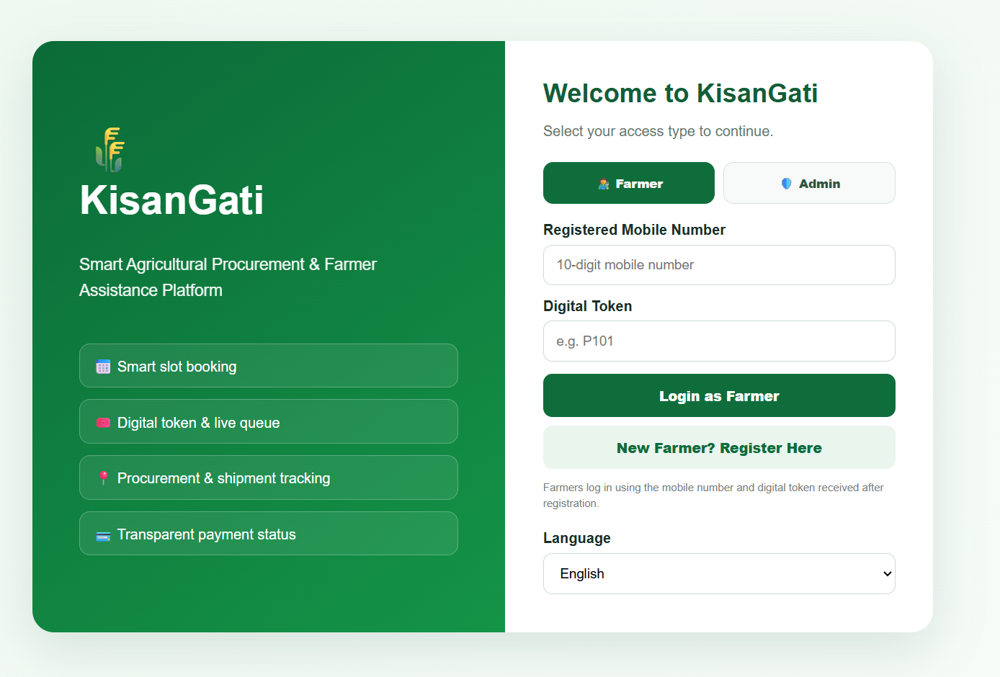
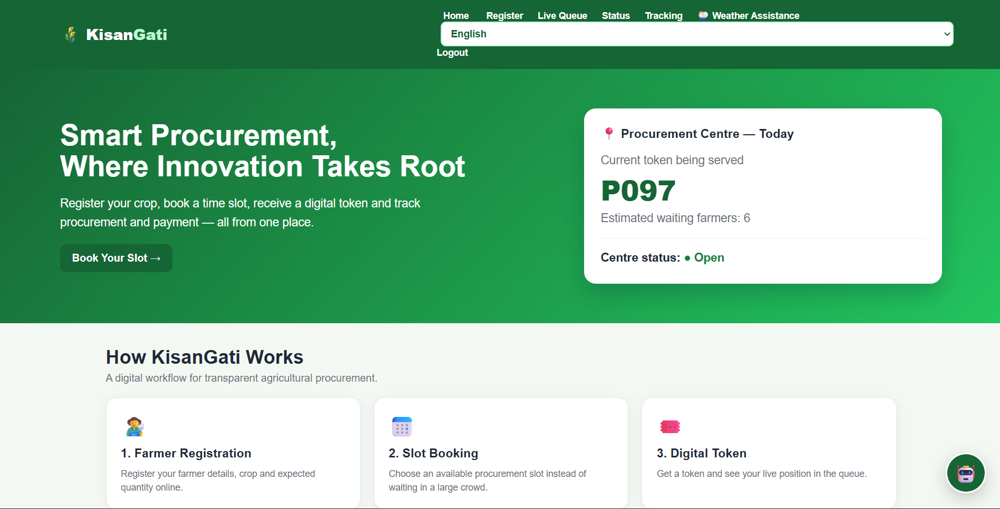
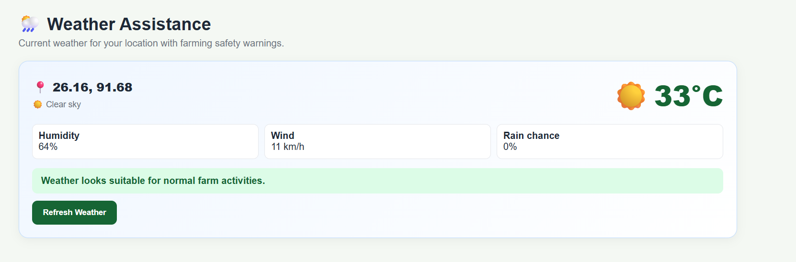
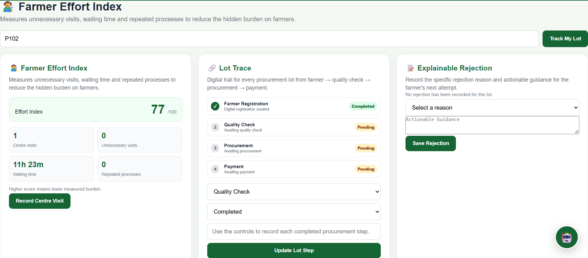
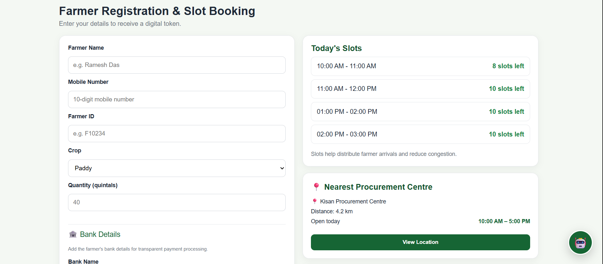
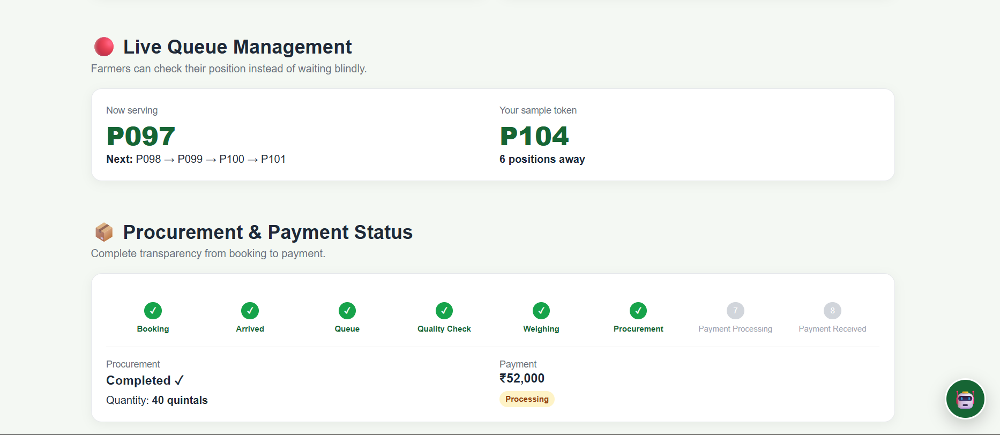
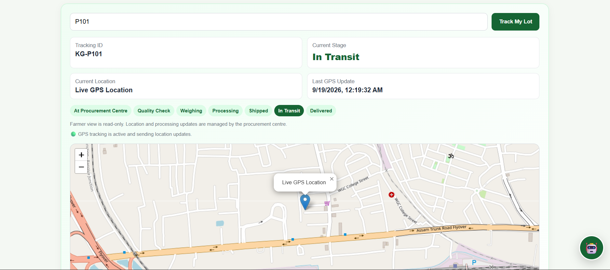
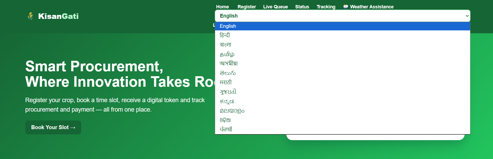
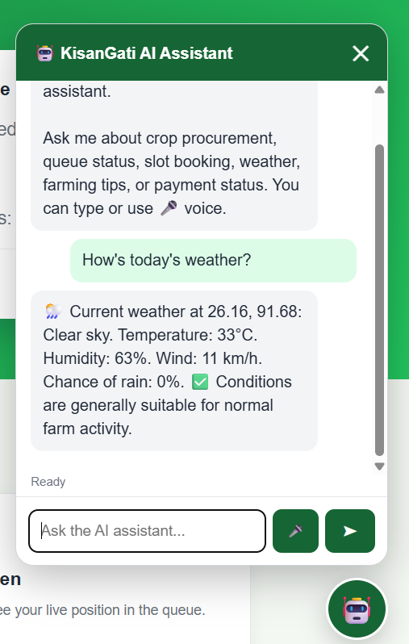

# 🌾 KisanGati

### Smart Agricultural Procurement & Farmer Assistance Platform

> **KisanGati** is a digital agricultural procurement platform designed to make the procurement journey simpler, more transparent, and more efficient for farmers — from slot booking and token generation to queue tracking, procurement status, shipment tracking, and payment information.

---

<p align="center">

  

  

  

  

  

</p>

---

## 📌 Overview

Agricultural procurement can involve long queues, uncertain waiting times, repeated visits to procurement centres, limited visibility into procurement status, and difficulties accessing timely information.

**KisanGati** aims to address these challenges through a unified digital platform where farmers can manage important parts of the procurement process from a single interface.

The platform combines:

- Digital farmer registration
- Procurement slot booking
- Digital token generation
- Live queue information
- Procurement status tracking
- Payment and bank information
- Shipment and GPS tracking
- Weather assistance
- Multilingual support
- AI-powered farmer assistance
- Farmer Effort Index
- Lot-level traceability
- Explainable rejection information
- Separate farmer and administrator workflows

The system is designed with a simple, farmer-friendly interface so that technology does not become another barrier in the procurement process.

---

# 🎯 Problem Statement

Traditional agricultural procurement processes can create several practical difficulties for farmers:

- Long and unpredictable waiting periods
- Multiple physical visits to procurement centres
- Lack of visibility into queue status
- Difficulty knowing the current stage of procurement
- Limited access to weather-related information
- Language barriers
- Lack of transparency regarding rejected lots
- Difficulty tracking produce after procurement
- Limited visibility into payment and shipment status

KisanGati brings these processes together into a single digital platform.

---

# 💡 Our Solution

KisanGati introduces a **digital procurement journey** that connects farmers, procurement centres, administrators, and procurement operations through one platform.

### Farmer Journey

```text
Farmer Registration
        ↓
Slot Booking
        ↓
Digital Token
        ↓
Live Queue
        ↓
Procurement Centre
        ↓
Quality Check
        ↓
Weighing
        ↓
Processing
        ↓
Shipment
        ↓
Delivery
        ↓
Payment / Status Tracking
```

The farmer can access relevant information throughout the process instead of repeatedly depending on physical visits or manual enquiries.

---

# ✨ Key Features

## 👨‍🌾 1. Farmer Registration

Farmers can register their procurement details digitally.

Information can include:

- Farmer name
- Mobile number
- Farmer ID
- Crop
- Quantity
- Procurement slot
- Bank information

This creates a digital record that can be used throughout the procurement workflow.

---

## 🎟️ 2. Digital Token Generation

After registration and slot booking, KisanGati generates a digital procurement token.

The token helps farmers identify their position in the procurement process without relying entirely on physical queues.

---

## 📅 3. Procurement Slot Booking

Farmers can select an available procurement slot according to the system's configured schedule.

This helps distribute procurement activity and reduce unnecessary congestion at procurement centres.

---

## 🔢 4. Live Queue Management

KisanGati provides queue information so that farmers can understand their approximate position in the procurement process.

The system maintains queue state using the PostgreSQL backend.

Farmers can view:

- Current token
- Their token
- Number of farmers ahead
- Queue status

---

## 📍 5. Procurement & Shipment Tracking

Farmers can track the progress of their produce through different procurement stages.

### Supported stages

```text
At Procurement Centre
        ↓
Quality Check
        ↓
Weighing
        ↓
Processing
        ↓
Shipped
        ↓
In Transit
        ↓
Delivered
```

Where available, GPS-based location information can also be associated with shipment tracking.

---

## 🛰️ 6. GPS-Based Tracking

The platform can use browser/device geolocation to support location-aware functionality.

GPS information can be used for:

- Shipment tracking
- Location updates
- Procurement-stage visibility
- Location-aware assistance

The system is designed to request location access through the browser rather than requiring a separate hardware device.

---

# 🌦️ 7. Weather Assistance

KisanGati provides weather information using location-based weather assistance.

The system can use:

- Browser geolocation
- Weather API data
- Current location information

This allows farmers to access relevant weather information from within the platform.

---

# 🤖 8. AI Farmer Assistant

KisanGati includes a floating AI assistant designed to provide quick assistance to farmers.

The assistant can help with common questions related to:

- Procurement
- Tokens
- Queue status
- Slots
- Weather
- Payment
- Tracking
- General platform usage

The interface also supports browser-based speech recognition and speech synthesis where supported by the user's browser.

---

# 🌐 9. Multilingual Interface

KisanGati supports multiple Indian languages to make the platform more accessible.

### Supported languages

| # | Language |
|---|---|
| 1 | English |
| 2 | Hindi |
| 3 | Bengali |
| 4 | Tamil |
| 5 | Assamese |
| 6 | Telugu |
| 7 | Marathi |
| 8 | Gujarati |
| 9 | Kannada |
| 10 | Malayalam |
| 11 | Odia |
| 12 | Punjabi |

The multilingual approach is particularly useful for reducing language-related barriers in agricultural technology.

---

# 🏦 10. Bank & Payment Information

Farmers can provide relevant bank details through the platform.

The system can maintain information such as:

- Bank name
- Account holder
- Account number
- IFSC code

These details can be associated with the farmer's procurement record for payment-related workflows.

> **Note:** Sensitive financial information should be handled carefully in a production deployment with appropriate encryption, access controls, and compliance requirements.

---

# 📊 11. Farmer Effort Index

One of the key differentiating features of KisanGati is the **Farmer Effort Index**.

The purpose of the index is to represent the amount of effort associated with a farmer's procurement journey.

The calculation can consider factors such as:

- Number of visits
- Waiting time
- Repeated visits
- Unnecessary procurement-centre visits

The goal is to provide a simple metric that can help identify process inefficiencies from the farmer's perspective.

---

# 🔎 12. Lot Traceability

KisanGati includes a **Lot Trace** feature to associate procurement information with a particular lot.

This can provide better visibility into:

- Lot identification
- Procurement stage
- Processing stage
- Shipment information
- Traceability history

The feature is intended to improve transparency throughout the movement of agricultural produce.

---

# ❌ 13. Explainable Rejection

Instead of simply displaying that a lot has been rejected, KisanGati supports structured rejection information.

The system can maintain:

- Rejection reason
- Related lot/token
- Rejection information
- Additional explanation

This creates a more transparent procurement experience for farmers.

---

# 👨‍💼 14. Admin Dashboard

KisanGati separates farmer and administrative workflows.

Administrators can manage operational information such as:

- Procurement stages
- Queue state
- Tracking information
- Lot trace information
- Rejection information
- GPS/stage updates

This provides a centralized operational interface for procurement management.

---

# 🔐 15. Authentication

KisanGati provides separate access flows for farmers and administrators.

### Farmer Login

Farmers can authenticate using:

```text
Mobile Number
      +
Digital Token
```

### Admin Login

Administrators use:

```text
Username
    +
Password
```

> For production deployments, administrator credentials should be replaced with properly managed authentication and securely stored credentials.

---

# 🏗️ System Architecture

```text
                        ┌─────────────────────┐
                        │       Farmer        │
                        └──────────┬──────────┘
                                   │
                                   ▼
                        ┌─────────────────────┐
                        │   KisanGati Web UI  │
                        │ HTML / CSS / JS     │
                        └──────────┬──────────┘
                                   │
                                   ▼
                        ┌─────────────────────┐
                        │   Flask Backend     │
                        │      Python         │
                        └──────────┬──────────┘
                                   │
             ┌─────────────────────┼─────────────────────┐
             │                     │                     │
             ▼                     ▼                     ▼
     ┌──────────────┐      ┌──────────────┐      ┌──────────────┐
     │ Procurement  │      │   Tracking   │      │ AI / Weather │
     │   Services   │      │   Services   │      │   Services   │
     └──────────────┘      └──────────────┘      └──────────────┘
             │                     │                     │
             └─────────────────────┼─────────────────────┘
                                   │
                                   ▼
                        ┌─────────────────────┐
                        │ Supabase PostgreSQL │
                        │      Database       │
                        └─────────────────────┘
                                   │
                                   ▼
                        ┌─────────────────────┐
                        │      Vercel         │
                        │     Deployment      │
                        └─────────────────────┘
```

---

# 🛠️ Technology Stack

## Frontend

- HTML5
- CSS3
- JavaScript
- Responsive UI
- Browser Geolocation API
- Browser Speech Recognition API
- Browser Speech Synthesis API

## Backend

- Python
- Flask
- REST-style API endpoints

## Database

- PostgreSQL
- Supabase
- Psycopg

## External Services

- Open-Meteo for weather assistance
- Browser Geolocation API
- Browser Speech APIs

## Deployment

- GitHub
- Vercel
- Supabase PostgreSQL

---

# 📂 Project Structure

```text
KisanGati/
│
├── app.py
├── database.py
├── requirements.txt
├── README.md
├── .gitignore
│
├── templates/
│   ├── ...
│   └── ...
│
├── static/
│   ├── css/
│   ├── js/
│   ├── images/
│   └── ...
│
└── ...
```

### Core Files

| File | Purpose |
|---|---|
| `app.py` | Main Flask application and application routes |
| `database.py` | PostgreSQL/Supabase database layer |
| `requirements.txt` | Python dependencies |
| `templates/` | HTML templates |
| `static/` | CSS, JavaScript and static assets |
| `.gitignore` | Prevents secrets and unnecessary files from being committed |
| `README.md` | Project documentation |

---

# 🗄️ Database Architecture

KisanGati uses **Supabase PostgreSQL** for persistent application data.

Important database entities include:

```text
farmers
    │
    ├── shipment_tracking
    │       └── tracking_updates
    │
    ├── farmer_effort
    │
    ├── lot_trace
    │
    └── rejection_records

app_state
```

### Main Data Areas

#### `farmers`

Stores farmer and procurement information.

Examples include:

- Farmer identity
- Mobile number
- Crop
- Quantity
- Token
- Slot
- Status
- Bank information
- Tracking ID

#### `shipment_tracking`

Stores shipment/procurement tracking information.

#### `tracking_updates`

Stores tracking history and location updates.

#### `farmer_effort`

Stores information required for calculating the Farmer Effort Index.

#### `lot_trace`

Stores lot-level traceability information.

#### `rejection_records`

Stores structured rejection information.

#### `app_state`

Stores application-level state such as queue/token information.

---

# 🔄 Procurement Workflow

```text
┌──────────────────────┐
│ Farmer Registration  │
└──────────┬───────────┘
           ▼
┌──────────────────────┐
│   Slot Selection     │
└──────────┬───────────┘
           ▼
┌──────────────────────┐
│ Digital Token Issued │
└──────────┬───────────┘
           ▼
┌──────────────────────┐
│    Live Queue        │
└──────────┬───────────┘
           ▼
┌──────────────────────┐
│ Procurement Centre   │
└──────────┬───────────┘
           ▼
┌──────────────────────┐
│    Quality Check     │
└──────────┬───────────┘
           ▼
┌──────────────────────┐
│       Weighing       │
└──────────┬───────────┘
           ▼
┌──────────────────────┐
│     Processing       │
└──────────┬───────────┘
           ▼
┌──────────────────────┐
│      Shipment        │
└──────────┬───────────┘
           ▼
┌──────────────────────┐
│     In Transit       │
└──────────┬───────────┘
           ▼
┌──────────────────────┐
│      Delivered       │
└──────────────────────┘
```

---

# 🌱 Why KisanGati?

KisanGati focuses on the farmer's experience rather than treating procurement as only an administrative process.

The platform brings together:

### Transparency

Farmers can see procurement and tracking information instead of depending entirely on manual enquiries.

### Accessibility

Multilingual support helps make the system more approachable for users from different linguistic backgrounds.

### Reduced Uncertainty

Digital tokens and queue information can help farmers understand where they stand in the procurement process.

### Traceability

Lot Trace connects procurement information with the movement of produce.

### Accountability

Explainable rejection information provides more context when a lot is not accepted.

### Farmer-Centric Measurement

The Farmer Effort Index focuses on the time and effort involved from the farmer's perspective.

---

# ⭐ Key Differentiators

| Feature | Purpose |
|---|---|
| 🎟️ Digital Token | Reduces dependence on physical queue management |
| 📊 Live Queue | Provides queue visibility |
| 📍 GPS Tracking | Adds location-aware tracking |
| 🌦️ Weather Assistance | Provides weather information based on location |
| 🤖 AI Assistant | Provides quick farmer assistance |
| 🌐 12 Languages | Improves accessibility |
| 📈 Farmer Effort Index | Represents farmer-side process effort |
| 🔎 Lot Trace | Improves produce traceability |
| ❌ Explainable Rejection | Provides context behind rejection |
| 🏦 Payment Information | Connects procurement records with bank details |
| 👨‍💼 Admin Dashboard | Supports procurement administration |

---

# 📱 User Experience

The platform is designed around a simple principle:

> **A farmer should be able to understand what is happening with their produce without repeatedly visiting the procurement centre just to ask for an update.**

The interface therefore prioritizes:

- Clear information
- Simple navigation
- Large actionable elements
- Multilingual access
- Quick status visibility
- Mobile-friendly interaction
- Voice-assisted interaction where supported

---

# 🏆 Smart India Hackathon

**Problem Statement:** SIH26032

KisanGati is designed as a solution for improving the agricultural procurement experience through digitalization, transparency, accessibility, and farmer-centric services.

---

# 🔮 Future Enhancements

Potential future improvements include:

### 📲 Mobile Application

Native Android/iOS applications for farmers and procurement-centre staff.

### 🔔 Notifications

SMS, WhatsApp, push notifications, or IVR alerts for:

- Slot confirmation
- Token calls
- Queue updates
- Procurement completion
- Payment updates
- Shipment updates

### 🧠 Advanced AI

An AI assistant could be expanded to provide:

- Crop-specific guidance
- Procurement policy explanations
- Personalized assistance
- Document assistance
- Voice-first interaction
- Regional language conversations

### 📈 Predictive Queue Estimation

Historical procurement data could be used to estimate:

- Waiting time
- Queue duration
- Procurement-centre load
- Expected service time

### 🗺️ Procurement Centre Discovery

Farmers could find nearby procurement centres based on:

- Distance
- Current queue
- Availability
- Procurement capacity
- Crop supported

### 📊 Analytics Dashboard

Authorities could monitor:

- Procurement volume
- Average waiting time
- Farmer effort
- Rejection patterns
- Centre utilization
- Shipment progress

### 🔗 Advanced Traceability

Future versions could integrate more detailed lot-level tracking across the agricultural supply chain.

---

# 👥 Project Team

Add your team information here:

```text
Team Name:
ERROR.EXE

Team Members:
1. Dhritiman Sarkar
2. Nandita Das
3. Pratyus Banik
4. Moitreyee Kashyap
5. Sania Yadav
6. Himarnabh Das
```

---

# 📸 Screenshots

## 📸 Screenshots

### 🔐 Login Page


### 👨‍🌾 Farmer Dashboard


### 🌦️ Weather Assistance


### 🛠️ Admin Smart Features


### 📅 Registration & Slot Booking


### 🎫 Queue & Payment Status


### 📍 Live GPS Tracking


### 🌐 Language Selection


### 🤖 AI Assistant

```

---

# 📄 License

This project is currently developed as an academic / hackathon project.

If you plan to distribute or reuse the project publicly, add an appropriate open-source license such as MIT, Apache-2.0, or another license that matches your intended usage.

---

# 🙌 Acknowledgements

KisanGati uses and builds upon several technologies and services, including:

- Python
- Flask
- PostgreSQL
- Supabase
- Vercel
- Open-Meteo
- Browser Geolocation APIs
- Browser Speech APIs

We thank the open-source community and the developers of these technologies for making the underlying tools available.

---

# 🌾 KisanGati

### Making agricultural procurement simpler, more transparent, and more farmer-friendly.

<p align="center">

**Digital Procurement • Live Queue • Tracking • Weather • AI Assistance • Traceability**

</p>
